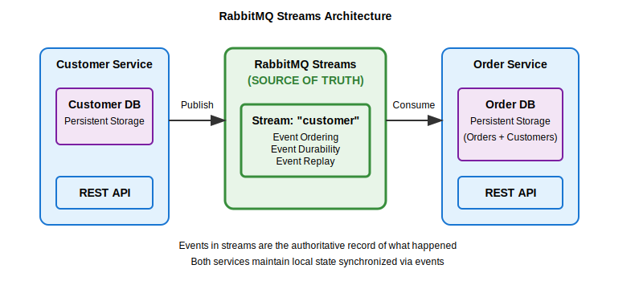
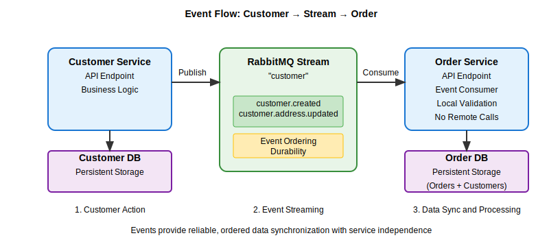
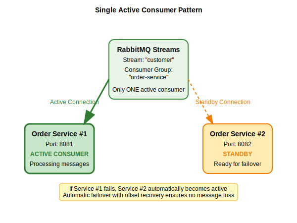

# RabbitMQ Streams Demo

## Purpose

This repository demonstrates **event-driven microservices architecture** using **RabbitMQ Streams** for reliable event streaming and **eventual consistency** between services. It showcases how services can maintain their own data while staying synchronized through events, providing a production-ready pattern for distributed systems.

## How It Works

### Architecture Overview



### Event Flow



### Single Active Consumer Pattern



## Features

### 🚀 **Event-Driven Architecture**
- **RabbitMQ Streams** for reliable, ordered event streaming
- **Event Types**: `customer.created`, `customer.address.updated`
- **Message Durability** with configurable retention

### 🔄 **Eventual Consistency**
- Customer service maintains source of truth
- Order service maintains customer replica for independence
- Automatic synchronization through events

### 🏗️ **High Availability**
- **Single Active Consumer** pattern prevents duplicate processing
- **Automatic Failover** between order service replicas
- **Reliable Producers/Consumers** with reconnection logic

### 📊 **Observability**
- **Prometheus Metrics** for all services
- **Structured Logging** with event tracing
- **Health Checks** and monitoring endpoints

### 🧪 **Testing Suite**
- **End-to-End Tests** demonstrating complete flow
- **Load Testing** with 100k customer simulation
- **Database Validation** for consistency verification

## How to Run

### Prerequisites

- Docker and Docker Compose
- Go 1.21+ (for running tests)

### 1. Start the System

```bash
make dependencies
```

This starts:
- **RabbitMQ** with streams enabled (ports 15672, 5552)
- **PostgreSQL** with separate databases
- **Customer Service** on port 8080
- **Order Service** replicas on ports 8081, 8082

### 2. Verify Services

| Service | URL | Purpose |
|---------|-----|---------|
| RabbitMQ Management | http://localhost:15672 | Monitor streams (guest/guest) |
| Customer Service | http://localhost:8080 | Customer API |
| Order Service #1 | http://localhost:8081 | Order API |
| Order Service #2 | http://localhost:8082 | Order API (standby) |

### 3. Run End-to-End Test

```bash
make run-e2e
```

This test demonstrates:
1. Creating customer with "unknown" address
2. Order creation failure scenarios
3. Address updates and successful order processing
4. Eventual consistency validation

### 4. Run Load Test

```bash
make run-load
```

Creates 100,000 customers and verifies data synchronization between services.

## API Usage

### Customer Service (http://localhost:8080)

#### Create Customer
```bash
curl -X POST http://localhost:8080/customers \
  -H "Content-Type: application/json" \
  -d '{
    "name": "John Doe",
    "email": "john@example.com", 
    "address": "123 Main St"
  }'
```

#### Update Customer Address
```bash
curl -X PUT http://localhost:8080/customers/{customer-id}/address \
  -H "Content-Type: application/json" \
  -d '{"address": "456 New Street"}'
```

### Order Service (http://localhost:8081 or 8082)

#### Create Order
```bash
curl -X POST http://localhost:8081/orders \
  -H "Content-Type: application/json" \
  -d '{"customer_id": "customer-uuid"}'
```

**Response Status Logic:**
- `"Processing"` - Valid customer with known address
- `"Failed"` - Customer address is "unknown"
- `400 Error` - Customer doesn't exist

#### Get Order
```bash
curl http://localhost:8081/orders/{order-id}
```

## Event Schema

### Stream Configuration
- **Stream Name**: `customer`
- **Max Size**: 1GB
- **Consumer Group**: `order-service`

### Event Types

#### Customer Created
```json
{
  "customer_id": "uuid-string",
  "name": "John Doe", 
  "email": "john@example.com",
  "address": "123 Main St",
  "timestamp": "2025-01-11T10:00:00Z"
}
```

#### Customer Address Updated
```json
{
  "customer_id": "uuid-string",
  "address": "456 New Street",
  "timestamp": "2025-01-11T10:00:00Z"
}
```

### Message Annotations
```json
{
  "event_id": "uuid-string",
  "event_type": "customer.created"
}
```

## Database Schema

### Customer Database (`customer_db`)
```sql
CREATE TABLE customers (
    id TEXT PRIMARY KEY,
    name TEXT NOT NULL,
    email TEXT NOT NULL, 
    address TEXT NOT NULL,
    created_at TIMESTAMP WITH TIME ZONE NOT NULL,
    updated_at TIMESTAMP WITH TIME ZONE
);
```

### Order Database (`order_db`)
```sql
-- Customer replica (subset of data)
CREATE TABLE customers (
    id TEXT PRIMARY KEY,
    address TEXT NOT NULL,
    updated_at TIMESTAMP WITH TIME ZONE NOT NULL
);

-- Orders table
CREATE TABLE orders (
    id TEXT PRIMARY KEY,
    customer_id TEXT NOT NULL,
    status TEXT NOT NULL
);
```

## Monitoring & Metrics

### Prometheus Metrics

**Customer Service** (`/metrics`):
- `customers_created_total`
- `customers_updated_total` 
- `events_published_total`
- `event_publish_errors_total`

**Order Service** (`/metrics`):
- `orders_created_total`
- `customers_processed_total`
- `customer_event_errors_total`

### Health Checks
- Customer Service: `http://localhost:8080/health`
- Order Services: `http://localhost:8081/health`, `http://localhost:8082/health`

## Troubleshooting

### Check Consumer Status
Visit RabbitMQ Management UI at http://localhost:15672 → Streams → "customer" to verify:
- Consumer connections
- Message rates
- Offset positions

### Verify Data Consistency
```bash
# Check customer count in both databases
docker exec -it demo-rabbitmq-streams-postgres-1 psql -U postgres -d customer_db -c "SELECT COUNT(*) FROM customers;"
docker exec -it demo-rabbitmq-streams-postgres-1 psql -U postgres -d order_db -c "SELECT COUNT(*) FROM customers;"
```

### View Service Logs
```bash
docker compose logs customer
docker compose logs order1
docker compose logs order2
```

## Architecture Benefits

1. **Service Independence**: Order service doesn't need direct customer service calls
2. **Scalability**: Horizontal scaling with single active consumer pattern  
3. **Reliability**: Event replay and guaranteed delivery
4. **Observability**: Full tracing through metrics and logs
5. **Consistency**: Eventual consistency with conflict-free updates

## Next Steps

- Add more event types (customer deletion, etc.)
- Implement event sourcing patterns
- Add data transformation layers
- Explore stream partitioning strategies
- Implement saga patterns for complex workflows